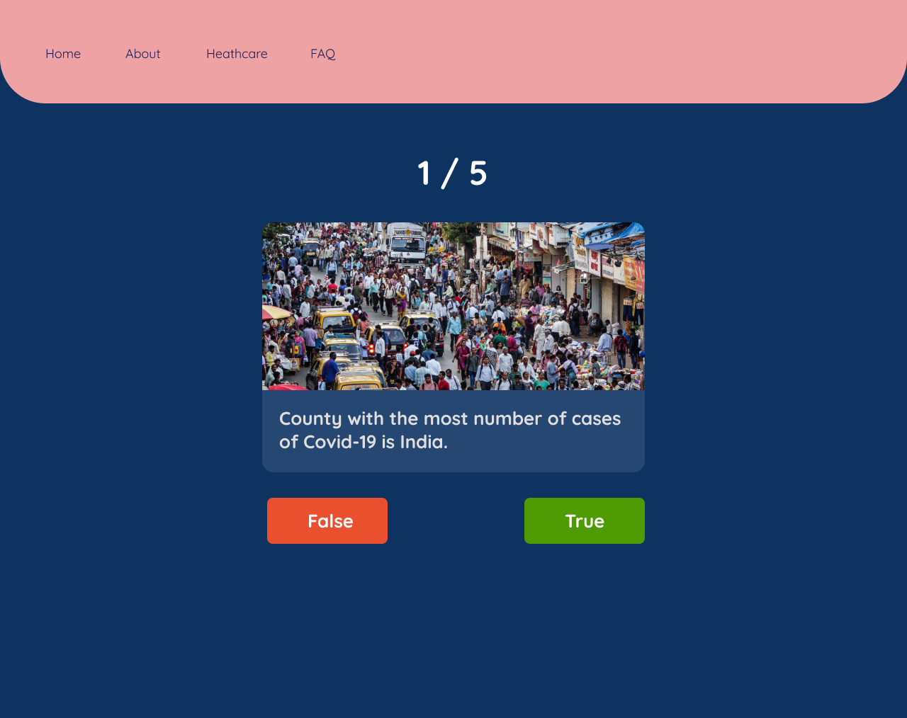

# tartanhacks2021
- figma => https://www.figma.com/file/To5tmt5KPdukLySm9Cgk9Z/Untitled?node-id=40%3A173




## Project setup

```
npm install
```

### Compiles and hot-reloads for development

```
npm run serve
```

### Compiles and minifies for production

```
npm run build
```
